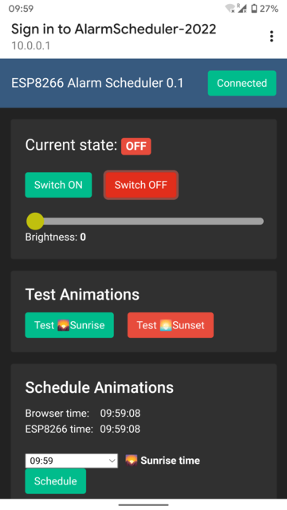
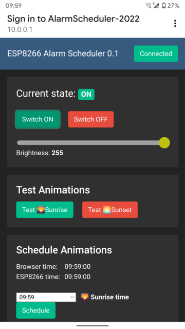
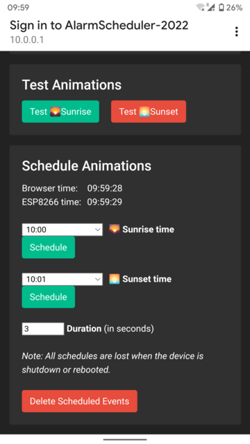
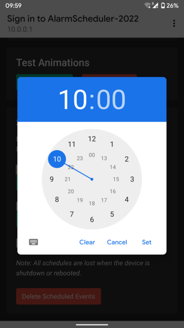

# Alarm Scheduler ESP-8266

ESP8266 Schedule alarms to occur at specific times via WebUI

### Hardware

* ESP-01S (ESP-8266)

### Features

* Onboard LED On & Off
* Brightness control
* Simulate 🌄Sunrise and 🌅Sunset
* Schedule simulations to specific times
* Set system time automatically when the first client connects

### Software

* WiFi in AP mode (Hotspot mode)
* Web Interface 100% Offline
* WebServer to handle HTTP Requests from clients
* WebSockets to broadcast updates to clients

### Screenshots
 
 
 
